# Arnaud's Train Stats

## Introduction

This repository contains maps and graphs about my personal train travel statistics, as well as the code used to generate them.
I started tracking all my journeys by train in a spreadsheet in 2022, and managed to fill the historic data all the way to 2013.

## Table of Contents

* [Full map & timeline](#full-map)
* [Timelines](#timelines)
* [Duration stats](#duration-stats)
* [Operator stats](#operator-stats)
* [Timing stats](#timing-stats)
* [Trip-specific maps](#trip-specific-maps)
* [Portrait maps](#portrait-maps)

## Full map

  
  

## Timelines

  <a href="https://raw.githubusercontent.com/Nosudrum/train-stats/main/plots/distance_timeline.png">
  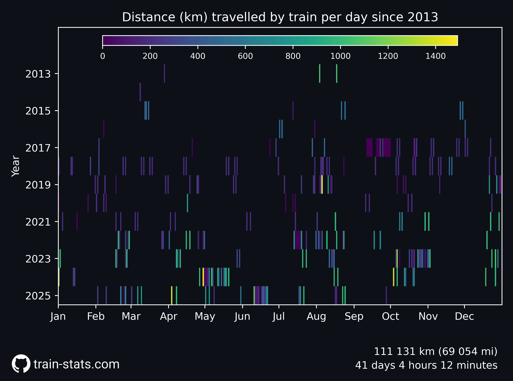
  </a>
  

  
  

  <a href="https://raw.githubusercontent.com/Nosudrum/train-stats/main/plots/duration_timeline.png">
  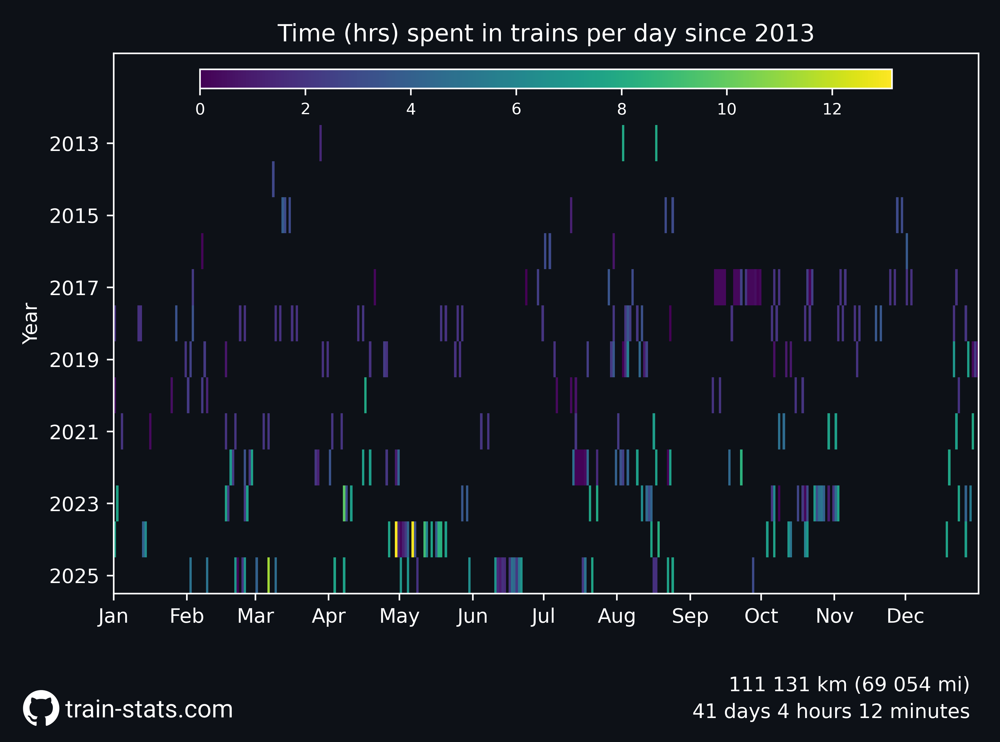
  </a>
  

## Duration stats

  
  

  
  

## Operator stats

  <a href="https://raw.githubusercontent.com/Nosudrum/train-stats/main/plots/number_per_operator.png">
  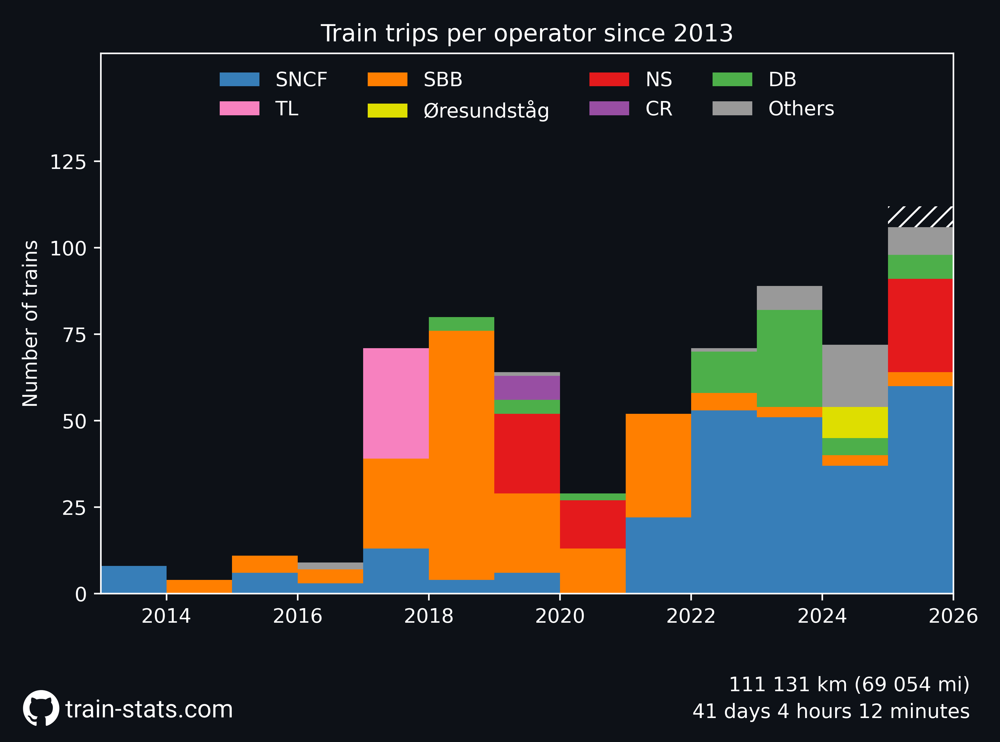
  </a>
  

  <a href="https://raw.githubusercontent.com/Nosudrum/train-stats/main/plots/distance_per_operator.png">
  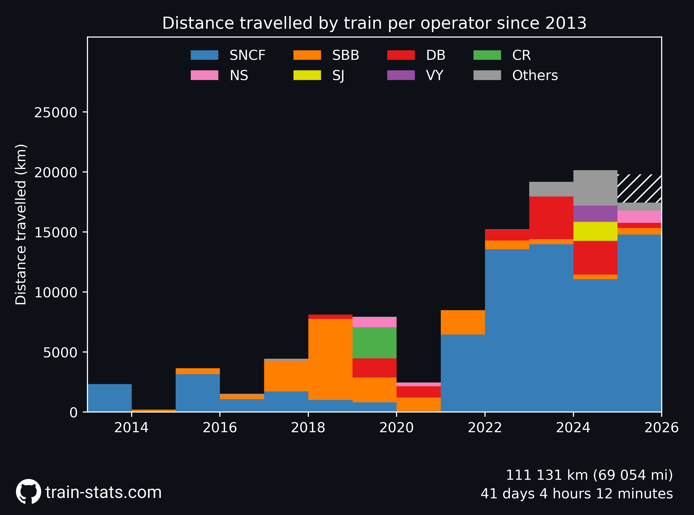
  </a>
  

  <a href="https://raw.githubusercontent.com/Nosudrum/train-stats/main/plots/duration_per_operator.png">
  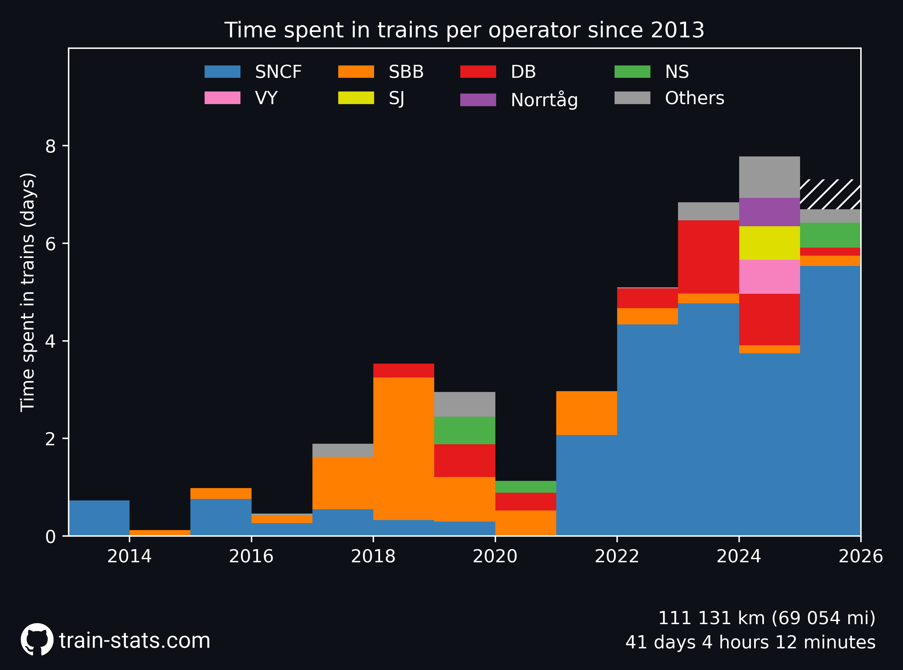
  </a>
  

  <a href="https://raw.githubusercontent.com/Nosudrum/train-stats/main/plots/spending_per_operator.png">
  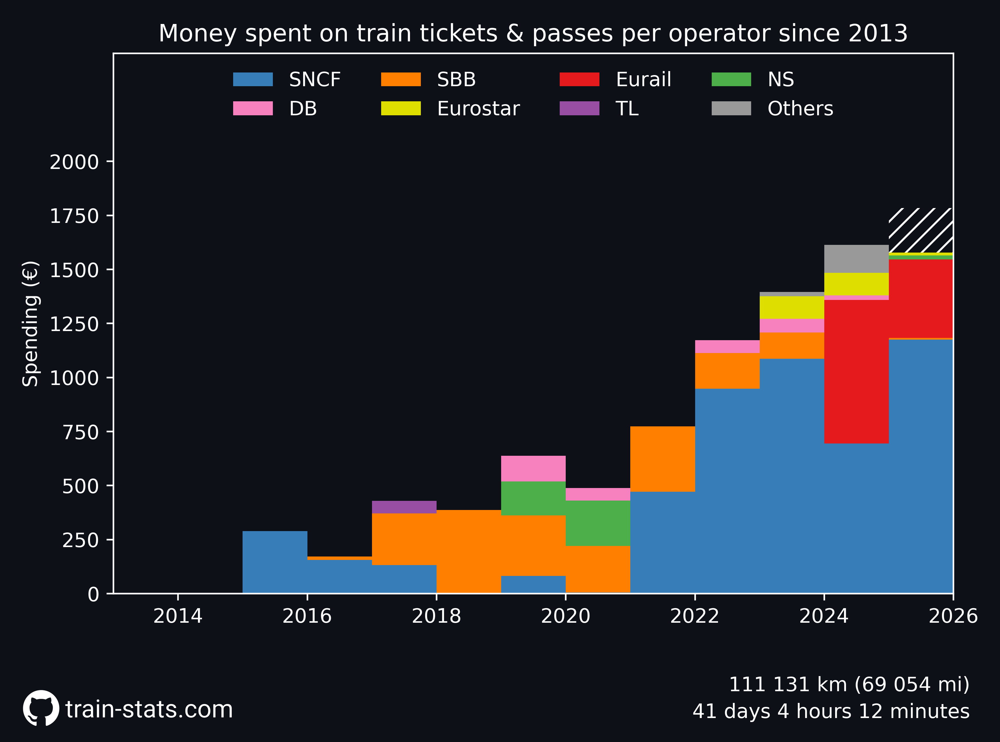
  </a>
  

  
  

## Trip-specific maps

  
  

  <a href="https://raw.githubusercontent.com/Nosudrum/train-stats/main/plots/2024_scandinavia.png">
  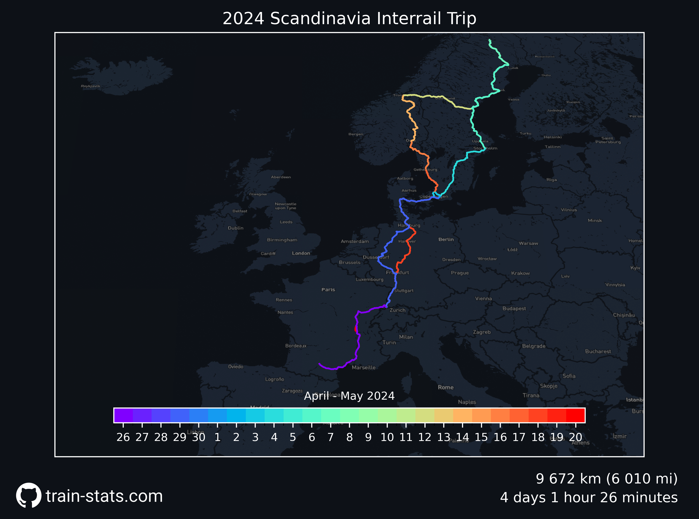
  </a>
  

  
  

  <a href="https://raw.githubusercontent.com/Nosudrum/train-stats/main/plots/2024_milano_iac.png">
  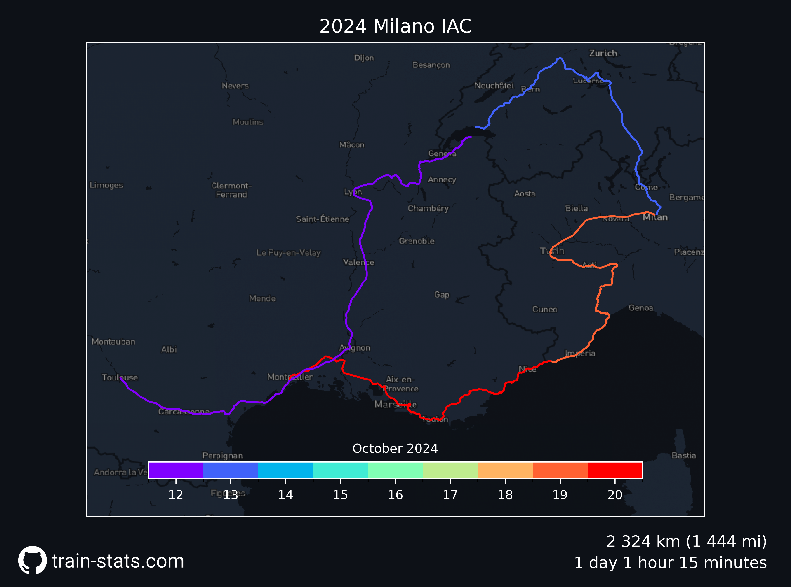
  </a>
  

  
  

## Portrait maps

  
    <a href="https://raw.githubusercontent.com/Nosudrum/train-stats/main/plots/all_europe_portrait.png">
  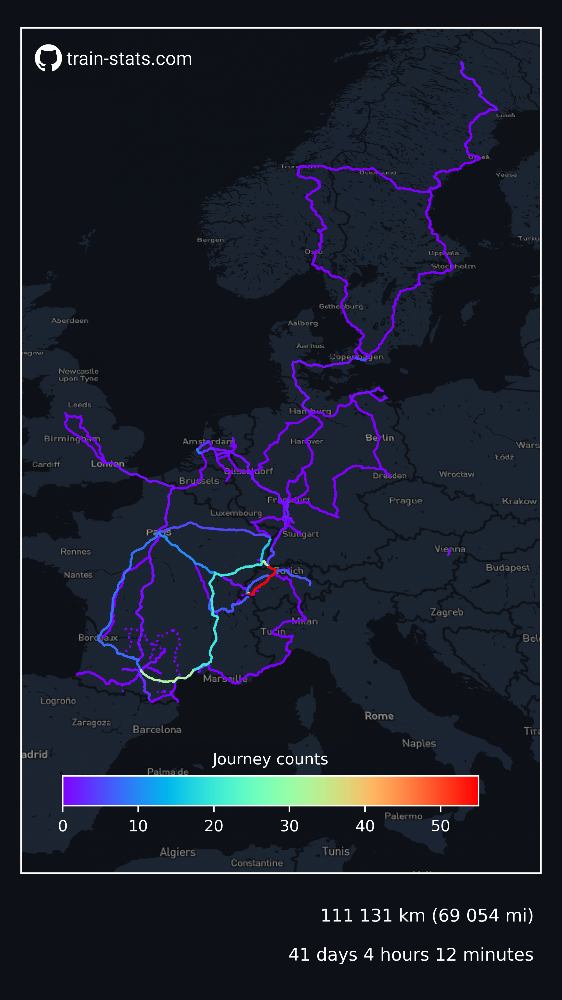
  </a>
  

    <a href="https://raw.githubusercontent.com/Nosudrum/train-stats/main/plots/2024_scandinavia_portrait.png">
  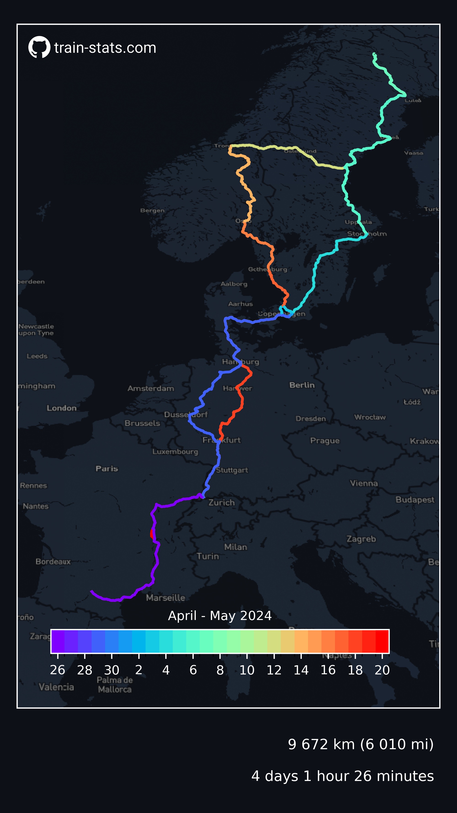
  </a>
    <a href="https://raw.githubusercontent.com/Nosudrum/train-stats/main/plots/2025_netherlands_germany_portrait.png">
  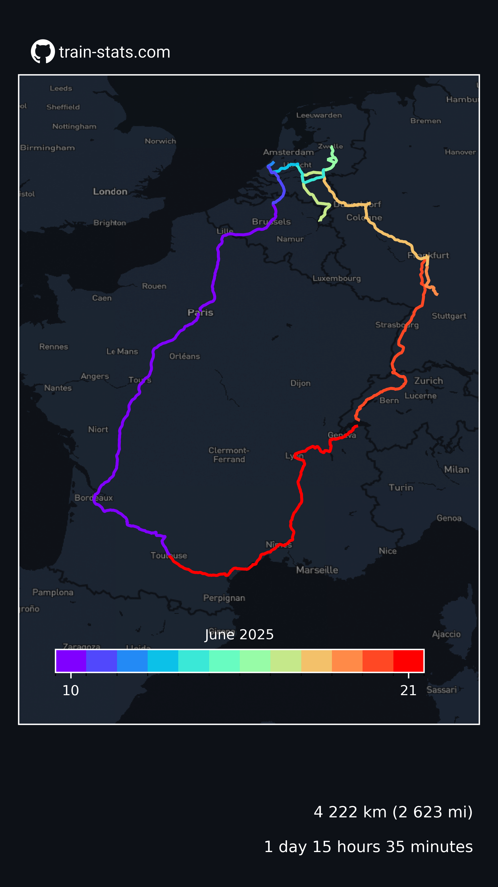
  </a>
  

  <a href="https://raw.githubusercontent.com/Nosudrum/train-stats/main/plots/2019_china_portrait.png">
  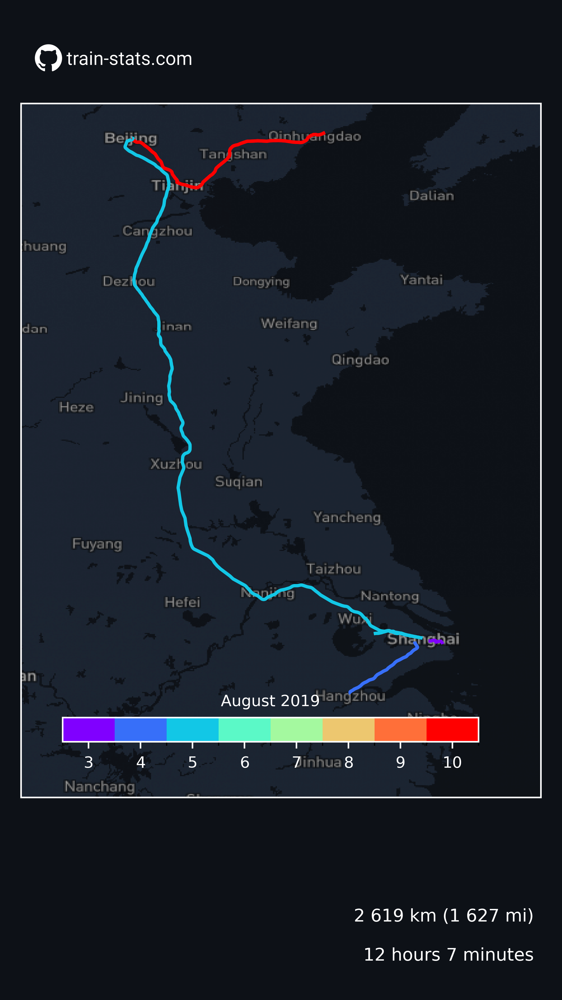
  </a>
  
  

